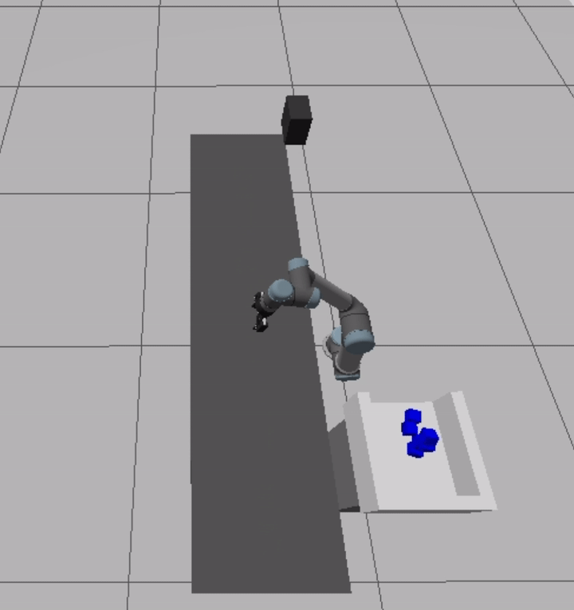

# ROS2 Vision-Guided Industrial Defect Sorting System

A fully autonomous industrial defect-sorting simulation built with **ROS 2 Jazzy, Gazebo Sim, OpenCV, UR5, and a Robotiq 2F-85 gripper**.

The system simulates an automated industrial production line in which products are transported along a conveyor belt, inspected using an RGB camera, classified by colour, and automatically handled by a robotic arm.

Red and green products are treated as normal products and pass through the production line. Blue products are classified as defective, stopped at a calibrated pick position, picked by the UR5 robot, and placed into a reject bin.

## Demo



🎥 [Watch Full Demo Video](Demo_Video.mp4)

---

## Key Features

- Fully automatic ROS 2 sorting workflow
- Gazebo Sim industrial conveyor environment
- RGB camera visual inspection
- OpenCV colour detection
- Robotiq 2F-85 gripper simulation


---

## Main ROS 2 Nodes

### 1. [`color_detector.py`](industrial_sorting_sim/color_detector.py)

Subscribes to the Gazebo RGB camera and performs OpenCV-based colour detection.

**Input**

```text
/sorting_camera/image
```

**Output**

```text
/detected_color
```

Possible values:

```text
RED
GREEN
BLUE
NONE
```

---

### 2. [`conveyor_controller.py`](industrial_sorting_sim/conveyor_controller.py)

Responsible for:

- Spawning products
- Moving products across the conveyor
- Stopping blue products at the pick point
- Removing red and green products at the exit
- Starting the next production cycle

Important output:

```text
/blue_pick_ready
```

The controller also exposes:

```text
/blue_rejection_done
```

for synchronisation with the robot controller.

---

### 3. [`sorting_robot_controller.py`](industrial_sorting_sim/sorting_robot_controller.py)

Waits until both conditions are satisfied:

```text
/detected_color = BLUE
```

and:

```text
/blue_pick_ready = true
```

It then executes the complete UR5 rejection trajectory.

The controller uses:

```text
/joint_trajectory_controller/follow_joint_trajectory
```

---

### 4. [`grasp_controller.py`](industrial_sorting_sim/grasp_controller.py)

Provides the simulated grasp interface:

```text
/grasp_blue
```

It controls object attachment, release, deletion, dynamic respawning, and gravity-based reject-bin placement.

---

## Requirements

The project was developed using:

- ROS 2 Jazzy
- Gazebo Sim
- Python 3
- OpenCV
- `cv_bridge`
- `ros_gz_bridge`
- `ros_gz_interfaces`
- `ros2_control`
- Universal Robots ROS 2 simulation packages
- Robotiq description package

A working **ROS 2 Jazzy + Gazebo Sim** installation is required before building the package.

---

## Build

Create a ROS 2 workspace and clone the repository into `src`:

```bash
mkdir -p ~/ros2_sorting_ws/src
cd ~/ros2_sorting_ws/src

git clone https://github.com/DerrickLongkai/ROS2-Vision-Guided-Industrial-Defect-Sorting-System.git
```

Build the workspace:

```bash
cd ~/ros2_sorting_ws
colcon build --symlink-install
```

Source the workspace:

```bash
source ~/ros2_sorting_ws/install/setup.bash
```

---

## Run

Launch the complete system:

```bash
ros2 launch industrial_sorting_sim sorting_system.launch.py
```

When Gazebo opens, press **Play**.

The complete system then runs automatically.

```text
RED   -> PASS
GREEN -> PASS
BLUE  -> DETECT -> STOP -> PICK -> REJECT BIN
```

No manual service calls are required during normal operation.

---

## Future Improvements

- Conveyor encoder-based tracking
- Dynamic picking of moving products
- Real UR5 / Robotiq hardware integration
- Production statistics and monitoring dashboard

---

## Author

**Longkai Zhang**

Computing Science Undergraduate  
Griffith College Cork
3:sorting_robot_controller
Waits until both conditions are satisfied:
/detected_color = BLUE
and:
/blue_pick_ready = true
It then executes the complete UR5 rejection trajectory.
The controller uses:
/joint_trajectory_controller/follow_joint_trajectory

4:grasp_controller
Provides the simulated grasp interface:
/grasp_blue
It controls object attachment, release, deletion, dynamic respawning, and gravity-based reject-bin placement.

Requirements
The project was developed using:
ROS 2 Jazzy
Gazebo Sim
Python 3
OpenCV
cv_bridge
ros_gz_bridge
ros_gz_interfaces
ros2_control
Universal Robots ROS 2 simulation packages
Robotiq description package
A working ROS 2 Jazzy and Gazebo Sim installation is required before building the package.

Build

Create a ROS 2 workspace and clone the repository into src:

mkdir -p ~/ros2_sorting_ws/src
cd ~/ros2_sorting_ws/src

git clone https://github.com/DerrickLongkai/ROS2-Vision-Guided-Industrial-Defect-Sorting-System.git

Build the workspace:

cd ~/ros2_sorting_ws
colcon build --symlink-install

Source the workspace:

source ~/ros2_sorting_ws/install/setup.bash

Run

Launch the complete system:

ros2 launch industrial_sorting_sim sorting_system.launch.py

When Gazebo opens, press Play.

The complete system then runs automatically
No manual service calls are required during normal operation.


Future Improvements
conveyor encoder-based tracking
dynamic pick of moving products
real UR5 / Robotiq hardware integration
production statistics and monitoring dashboard
